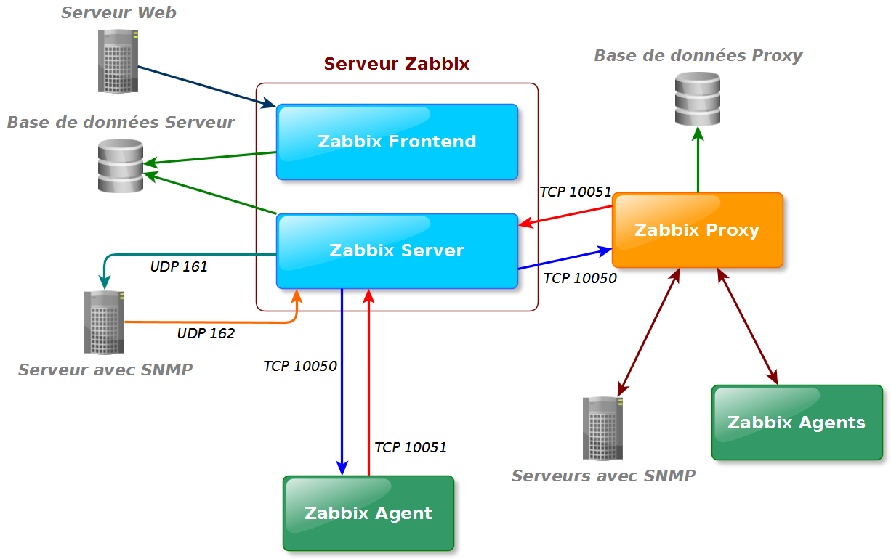
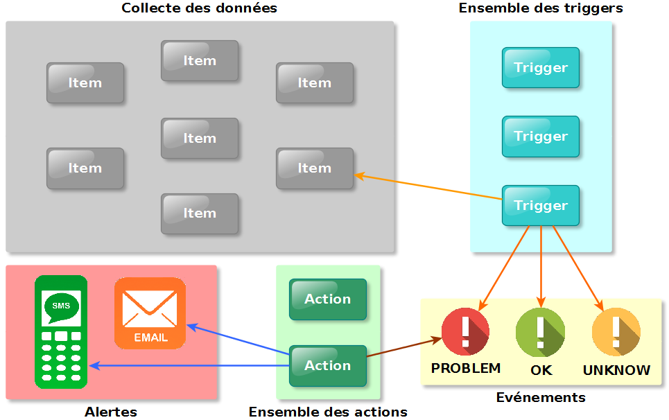

= Evolution de la Plateforme de Supervision et Optimisation du Réseau
Thibaut Fabre
:revealjs_theme: league
#:revealjs_customtheme: <file|URL>
:revealjs_controls: true
:revealjs_progress: true
:revealjs_slideNumber: true
:revealjs_center: true

== Supervision

[cols="1a",frame=none,grid=none]
|===
|* *_surveiller_ le bon fonctionnement* d’un système
* à *_alerter_ les éventuelles pannes*

|Principes::
* Récupérer l'utilisation des ressources sur les environnements surveillés
* Analyser chaque valeur récupérée
* Alerter les responsables de l'infrastructure en cas de dysfonctionnement repéré
|===

== Sommaire

* Contexte
* Zabbix
* Ansible

== Contexte

=== SQLI Group

* ESN française fondé en 1990
* Spécialisé dans la transformation digitale
* Chiffre d'affaire 2015:
* Plus de 2000 collaborateurs en Europe et en Afrique du nord.

=== ISC France

* _Innovative Services Center_
* Entité situé à Bordeaux et à Nantes
* Plus de 200 collaborateurs à Bordeaux et 50 à Nantes

=== Pôle CRCI

[cols="1a",frame=none,grid=none]
|===
|* _Centre de Ressources et de Compétences Informatiques_
* Responsable de l’infrastructure système et réseau, de la gestion du parc informatique et fourni une assistance technique

|Equipe de 3 collaborateurs::
* responsable : Arnaud Roudsovsky
* 2 ingénieurs : Frédéric Gracia et Romain Ballan

^|Collaboration avec le _Pôle Expertise_ pour *DevOps*
|===

=== DevOps

* Culture
* Automation (automatisation)
* Lean
* Measurement (mesure)
* Sharing (solidarité)

---

[cols="1a",frame=none,grid=none]
|===
|Outils émergeant::
 _Docker_, _Jenkins_, _Ansible_, _OpenStack_
|===

=== Infrastructure

[cols="4",frame=none,grid=none]
|===
|VMWare |Openstack |Docker |OpenVZ
|===

---

[cols="1a",frame=none,grid=none]
|===
|*Cloud computing*::
Paradigme récent ayant pour but de centraliser et d’utiliser au maximum la puissance de calcul de chaque serveur
|===

---

[cols="1a",frame=none,grid=none]
|===
|*Besoin*::
Mettre à jour la plateforme de *supervision*
|===

== Zabbix

=== Présentation

[cols="1a",frame=none,grid=none]
|===
|Ensemble d'outils OpenSource
|===

---

[cols="1a",frame=none,grid=none]
|===
|Le raisons de ce choix :
|===

* Open source et large communauté
* Web scénario
* _Service Level Agreement_
* Equipe déjà formée
* Possibilité de monitorer container *Docker*

=== Architecture et fonctionnement

[cols="10",frame=none,grid=none]
|===
5+^.^a|[[img-sunset]]

5+^.^a|[[img-sunset]]

|===

=== Supervision de container Docker

- image fonctionnement

=== Conclusion sur l'installation

[cols="10",frame=none,grid=none]
|===
2+<|_Apports_:
8+<|Supervision des containers +
Supervision par les scénarios web.
|===

---

[cols="10",frame=none,grid=none]
|===
2+<|_Limites_:
8+<|Manque de précision sur certaines alertes +
Base de données peut devenir une limite +
Pas de sauvegarde de la base de données.
|===

== Ansible

=== Pourquoi en avoir besoin ?

[cols="1a",frame=none,grid=none]
|===
|Logiciel open source permettant la configuration et la gestion à distance des machines
|===

---

[cols="1a",frame=none,grid=none]
|===
|Utilisation de protocole de communication (SSH et WinRM) pour exécuter des scripts
|===

---

[cols="1a",frame=none,grid=none]
|===
|Utilisation indispensable pour mettre à jour les agents déjà présents
|===

=== Conclusion de l'outil

[cols="10",frame=none,grid=none]
|===
2+<|_Apports_:
8+<|Gain de temps +
Effectuer des montées de version en masse.
|===

---

[cols="10",frame=none,grid=none]
|===
2+<|_Limite_:
8+<|Fonctionnement instable sous Windows
|===

== Conclusion

[cols="1a",frame=none,grid=none]
|===
|* Zabbix apporte un nouveau plus dans la gestion de l'infrastructure
* Ansible aidera dans l'avenir les ingénieurs du pôlegal

|* Equipes innovantes et dynamiques
* Apprentissage du métier d'ingénieur Réseaux et Système
* Travailler dans la culture DevOps
|===
